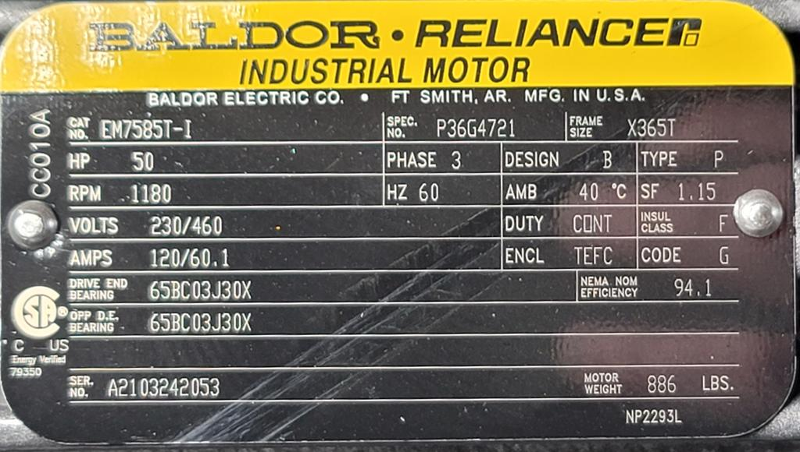

# Conclusion

## Module Summary

This module established the electrical and commercial fundamentals for all ITAC energy assessment work. You've learned to work fluently with both electrical and thermal units, understand AC power systems, and interpret commercial utility billing structures. These concepts form the foundation for analyzing equipment and identifying savings opportunities.

### Key Takeaways

**Power and Energy:** You learned the foundational units used throughout energy work: electrical power (kW) versus energy (kWh), thermal power (MMBtu/hr) versus energy (MMBtu), and the conversion factor linking them (1 kWh = 3,412 BTU). These units and conversions appear in every energy calculation you'll perform.

**AC Power:** Nearly all industrial facilities use three-phase AC power for major equipment. Real power (kW) does useful work, reactive power (kVAR) establishes magnetic fields, and apparent power (kVA) is what the utility must supply. Power factor is the ratio of real to apparent power. Low power factor wastes electrical capacity and can result in utility penalties. Three-phase systems are more efficient than single-phase for motor-driven equipment because they deliver smoother power.

**Utilities:** Commercial electricity billing involves both consumption charges (\$/kWh for energy used) and demand charges (\$/kW for peak power). Ratchet clauses can extend the impact of a single demand spike across many months. Power factor penalties charge facilities for inefficient use of electrical capacity. Natural gas billing is generally simpler (volume-based), while delivered fuels like propane and fuel oil require reconstructing consumption from delivery records.

---

## Practice Questions

### Question 1: Power and Energy Conversions

A facility operates a 150 HP electric motor at 90% motor efficiency and 85% load factor for 6,000 hours per year.

**Part A:** Calculate the actual electrical power draw (kW) of the motor under these operating conditions.

**Part B:** Calculate the annual electricity consumption (kWh) for this motor.

**Part C:** Convert the annual electrical consumption to thermal units (MMBtu).

**Part D:** If electricity costs $0.12/kWh, calculate the annual energy cost for this motor.

### Question 2: AC Power and Power Factor

A facility has the following electrical loads on a three-phase system:
- Real power consumption: 800 kW
- Reactive power consumption: 600 kVAR

**Part A:** Calculate the apparent power (kVA) being supplied.

**Part B:** Calculate the power factor.

**Part C:** The utility penalizes power factor below 0.90 by billing demand charges by kVA instead of kW. How much does this penalty cost if demand charges are $18/kW?

**Part D:** The facility installs 500 kVAR of power factor correction capacitors. Calculate the new power factor.

### Question 3: Utility Bill Analysis

A manufacturing facility receives the following monthly electric bill:
- Consumption: 450,000 kWh at $0.095/kWh
- Peak demand: 820 kW at $18.50/kW
- The facility has a 12-month ratchet clause at 80% of the highest demand

**Part A:** Calculate this month's total electricity cost (consumption + demand).

**Part B:** The peak demand of 820 kW occurred during an unusual production run and is 15% higher than typical monthly peaks of 710 kW. Due to the ratchet clause, what is the minimum demand charge the facility will pay in each of the next 11 months?

**Part C:** Calculate the total excess cost over the next 11 months due to this single demand spike (compared to if demand had been 710 kW).

**Part D:** Suggest two strategies the facility could implement to avoid future demand spikes.

### Question 4: Three-Phase Power Fundamentals

Consider the motor with the following nameplate. It is operating at 460 V. 

**Part A:** Assuming the motor operates at full load with 0.88 power factor, calculate the motor's real and apparent power. 

**Part B:** Calculate the rating (in kVAR) of capacitors needed to correct the power factor to 0.95. 

**Part C:** Explain why three-phase power is preferred over single-phase for motors above 5 HP.
