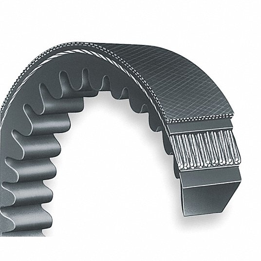

# Belts and Power Transmission

Between the motor shaft and the driven equipment, mechanical power must be transmitted and often the speed must be changed. Belt drives are one of the most common methods for accomplishing this in industrial settings. They are quieter than gear drives, require no lubrication, and can accommodate some misalignment. However, they also introduce efficiency losses that are worth understanding and minimizing.

## Traditional V-Belts

{width="350", align=right}

**V-belts** are the traditional workhorse of industrial power transmission. They are wedge-shaped in cross section and ride in V-shaped grooves in the pulleys (called sheaves). Power is transmitted through friction between the belt and sheave surfaces.

The wedge shape is the key design feature: as the belt is pulled into the groove under tension, the angled sides create a wedging action that multiplies the effective friction force. This allows V-belts to transmit significant power without requiring extremely high tension.

V-belts are inexpensive, quiet, and tolerant of minor misalignment and shock loads. However, they have inherent efficiency limitations:

1. **Slip.** Because V-belts rely on friction, some slip between the belt and sheave is inevitable. This slip increases with load and belt wear.

2. **Flexing losses.** Energy is lost as the belt bends around the sheaves and straightens again. The solid rubber construction resists bending, and this resistance converts mechanical energy to heat.

3. **Belt creep.** Even without gross slip, the belt stretches slightly on the tight side and contracts on the slack side, resulting in a small speed reduction.

A new, properly tensioned traditional V-belt drive typically operates at approximately **95% efficiency**. As belts wear and stretch, efficiency can drop to 90% or lower. Proper tensioning is critical: belts that are too loose slip excessively, while belts that are too tight increase bearing loads and reduce belt life.

## Notched (Cogged) V-Belts

{width="350", align=right}

**Notched V-belts** (also called cogged V-belts) have the same basic wedge profile as traditional V-belts but feature notches or cogs cut into the inner surface. These notches run perpendicular to the belt length at regular intervals.

The notches serve an important purpose: they allow the belt to bend more easily around the sheaves. This reduced bending resistance translates directly into lower flexing losses and improved efficiency. A notched V-belt drive typically operates at approximately **97% efficiency**, a meaningful improvement over the 95% efficiency of traditional V-belts.

**Notched V-belt advantages:**

1. **Higher efficiency.** The 2 percentage point improvement over traditional V-belts may seem modest, but it compounds over thousands of operating hours.

2. **Better heat dissipation.** The notches increase surface area and allow air circulation, helping the belt run cooler.

3. **Improved flexibility.** The belt can wrap around smaller sheaves without excessive stress, which can be useful in compact drive designs.

4. **Drop-in replacement.** Notched V-belts use the same sheaves as traditional V-belts. No hardware changes are required for the upgrade.

5. **Longer service life.** The reduced heat buildup and lower internal stresses typically result in longer belt life compared to traditional V-belts in the same application.

**Notched V-belt considerations:**

1. **Higher cost.** Notched V-belts cost more than traditional V-belts, though the price premium has decreased as they have become more common.

2. **Noise.** Some installations report slightly higher noise levels due to the notches engaging and disengaging from the sheave surface.

Because notched V-belts are a direct replacement for traditional V-belts with no sheave changes required, upgrading is straightforward. For motors running significant hours, the efficiency improvement typically pays back the cost difference quickly.

## Other Belt Types

While V-belts and notched V-belts dominate general industrial applications, several other belt types serve specialized purposes. Understanding their characteristics will help you recognize opportunities and limitations during facility assessments.

### Synchronous (Timing) Belts

**Synchronous belts** have teeth on their inner surface that mesh with matching grooves in the pulleys (called sprockets rather than sheaves). Power is transmitted through positive mechanical engagement rather than friction.

**Benefits:**

1. **No slip.** The positive engagement means the output shaft speed is precisely determined by the input speed and the pulley ratio. This is essential for applications requiring exact timing, such as camshaft drives in engines or coordinated motion in automation equipment.

2. **High efficiency.** Synchronous belts typically maintain 97% to 99% efficiency throughout their service life, since there are no friction-based slip losses.

3. **Lower tension requirements.** Because they do not rely on friction, synchronous belts can operate at lower tension than V-belts, reducing bearing loads and extending bearing life.

4. **Consistent performance over time.** Unlike V-belts, which stretch and lose efficiency as they wear, synchronous belts maintain their performance characteristics until they fail.

5. **Longer service life.** When properly installed and aligned, synchronous belts often outlast V-belts in comparable applications.

**Drawbacks:**

1. **Higher initial cost.** Both the belts and the sprockets cost significantly more than V-belt components. Retrofitting an existing V-belt drive requires replacing the sheaves with sprockets.

2. **Alignment sensitivity.** Synchronous belts require more precise pulley alignment than V-belts. Misalignment causes rapid edge wear and premature failure.

3. **Noise.** The tooth engagement produces more noise than friction-driven belts, though modern tooth profiles (such as curvilinear designs) have reduced this considerably.

4. **No overload protection.** V-belts slip when overloaded, providing a degree of protection for downstream equipment. Synchronous belts do not slip and will either transmit the overload or break.

5. **Vibration sensitivity at certain speeds.** The periodic tooth engagement can excite resonances in some systems, requiring careful attention to drive design.

Synchronous belts are the right choice when precise speed ratios are required, when maximum efficiency justifies the higher cost, or when the application demands consistent performance over a long service life.

### Flat Belts

**Flat belts** are the oldest belt drive technology, predating V-belts by decades. They are simple rectangular cross-section belts that ride on flat or slightly crowned pulleys. Power transmission relies entirely on friction between the flat belt surface and the pulley face.

**Benefits:**

1. **High efficiency at high speeds.** Flat belts can achieve 98% or higher efficiency, particularly at high speeds where flexing losses per unit of power transmitted are relatively low.

2. **Quiet operation.** The smooth belt surface produces minimal noise.

3. **Long center distances.** Flat belts work well in applications where pulleys are far apart.

4. **Simple pulley design.** Flat pulleys are easier and cheaper to manufacture than sheaves or sprockets.

**Drawbacks:**

1. **High tension required.** Without the wedging action of V-belts, flat belts require higher tension to transmit the same power, increasing bearing loads.

2. **Limited power capacity.** For a given belt width, flat belts transmit less power than V-belts.

3. **Tracking issues.** Flat belts can wander off the pulleys if alignment is not precise. Crowned pulleys help but do not eliminate this issue.

4. **Sensitivity to contamination.** Oil, water, or dust on the belt or pulley surfaces dramatically reduces the friction coefficient and power transmission capability.

Modern flat belts made from reinforced polyurethane or rubber compounds have revived interest in this technology for certain applications, particularly high-speed machinery and conveyors.

## Maintenance and Replacement Criteria

**Belt inspection checklist:**

1. Check for cracks, fraying, or glazed (shiny, hardened) surfaces.
2. Look for uneven wear patterns that indicate misalignment.
3. Check tension with a tension gauge or the deflection method specified by the belt manufacturer.
4. Inspect sheave grooves for wear. Worn grooves that no longer match the belt profile will accelerate belt wear and increase slip.
5. Verify alignment using a straightedge or laser alignment tool.
6. For multiple belt drives, check that all belts are matched sets from the same manufacturer and installed at the same time.

**When to replace:**

V-belts should be replaced when they show visible damage, when tension cannot be properly maintained (belts have stretched beyond adjustment range), or when slip becomes excessive despite proper tensioning. Many facilities replace V-belts on a time-based schedule (every 2 to 3 years for continuously running equipment) rather than waiting for failure.

**Upgrading from traditional V-belts to notched V-belts:**

This is a straightforward and cost-effective ITAC recommendation because notched V-belts use the same sheaves as traditional V-belts. The upgrade can happen at the next scheduled belt replacement with no additional hardware costs.

For example, consider a 50 HP motor running 6,000 hours per year at $0.10/kWh, currently using traditional V-belts at 95% efficiency:

Current annual energy cost for the belt drive losses:

$$P_{shaft} = 50 \text{ HP} \times 0.746 \text{ kW/HP} = 37.3 \text{ kW}$$

$$P_{input,current} = \frac{37.3 \text{ kW}}{0.95} = 39.26 \text{ kW}$$

With notched V-belts at 97% efficiency:

$$P_{input,new} = \frac{37.3 \text{ kW}}{0.97} = 38.45 \text{ kW}$$

$$P_{savings} = P_{input,current} - P_{input,new} = 0.81~\text{kW}$$

$$E_{savings} = P_{savings} * \text{Operating Hours} = 0.81 * 6000 = 4,860~\text{kWh}$$

