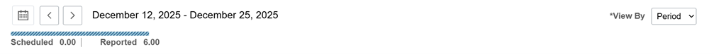
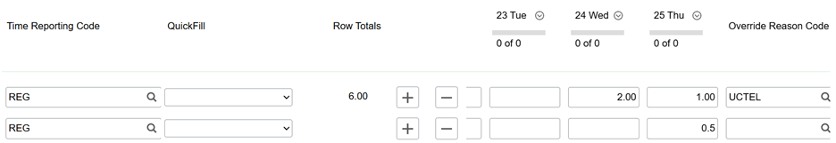

# Entering Hours

Employees manage all hourly labor charges (both in person and virtual) through the online **UConn Employee Self Service (ESS) Portal**. Hours entered into the portal are approved and paid on a **bi weekly basis**.

It is the responsibility of each employee to accurately and honestly track and report the hours worked during a pay period.

---

## Submitting Hours

The ESS Portal can be accessed at:

[ess.uconn.edu](https://ess.uconn.edu)

Employees log in using **Core-CT Sign On**.

From the homepage you will see several payroll related tiles. The tile used most frequently is the **Time** tile.

### Accessing the Time Entry Page

1. Click the **Time** tile  
2. Click **Enter Time**

You will then arrive at the time entry page.

At the top of the page you will see the **current pay period dates**. The system automatically opens to the active pay period.

!!! warning
    Hours **cannot be entered after a pay period closes**.  
    Be sure to submit hours before the end date of the current pay period.

---

## Entering Time

There are **three important fields** used when entering hours:

- **Time Reporting Code**
- **Override Reason Code**
- **Daily Hours**

### Time Reporting Code

The **Time Reporting Code** should always be: **REG**

This only needs to be entered **once per pay period**. After the first entry it will usually auto populate, but it should still be **verified each time hours are submitted**.

### In Person vs Virtual Hours

Employees at ITAC work a combination of **in-person** and **virtual** hours.

**In-person hours** include:
- Meetings
- Assessments
- Events
- Any work performed at a physical location

For **in-person work**, the **Override Reason Code should remain blank**.

**Virtual hours** include work completed remotely from a location of the employee's choosing.

For **virtual work**, enter the following in the **Override Reason Code**: **TELCM**

### Creating Time Entry Rows

A **separate row must be used** for in-person and virtual hours.

Example:
- One row for **in-person hours**
- One row for **virtual hours**

It is common to log **both types of hours in the same day**, but they must be recorded in the appropriate row.

To add a new row, press the **"+" button** on the time entry page.

---

## Submitting Hours

After entering hours, click the **Submit** button.

!!! note
    The **Submit** button only saves and updates your hours.  
    It does **not finalize your timesheet**.

Hours can be edited and resubmitted **as many times as needed during the pay period**.

It is considered **best practice to submit hours after each day worked**.

At the end of the pay period **no additional action is required**. The most recent saved hours are automatically sent for approval.

---

## Hours Approval Form

While hours entered in ESS are submitted for payroll approval, ITAC also requires hours to be verified through the **Hours Approval Form**.

[Hours Approval Form](https://airtable.com/appPtnvoky0Nze9Wq/pagABSLTpmIbWIL6e)

This form must be completed **weekly**.

### What to Include

When submitting the form, employees must provide a **task-level breakdown of the work completed during the week**, including:

- A list of tasks completed
- The **number of hours spent on each task**

This documentation is required to maintain compliance with **federal grant reporting standards**. ITAC must be able to substantiate hours worked at the **task level** in the event of an audit.

### Example

Wrote best practices section for REPORT_NAME (0.5 hours)
Wrote reduce setpoint recommendation for REPORT_NAME (3 hours)
Attended weekly meeting (1 hour)

### Submission Deadline

Hours must be submitted to **Airtable approval form by 8:00 PM on Thursday each week**.

!!! warning
    If the **Airtable Hours Approval Form** is not completed, supervisors cannot approve your hours in CoreCT.
