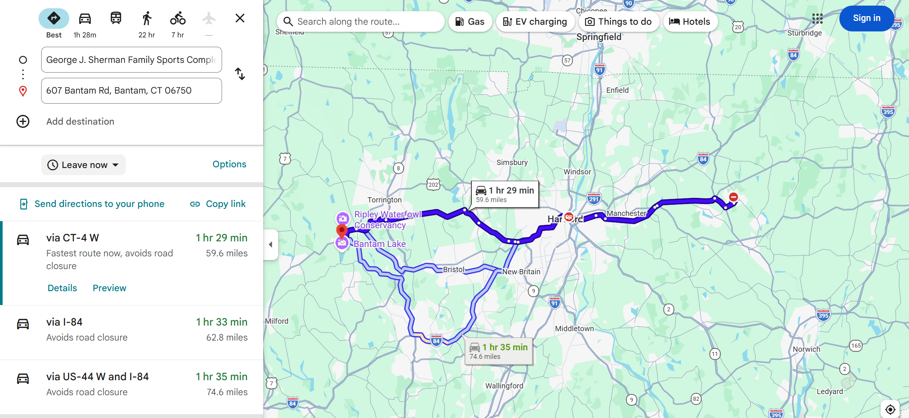

# Mileage Reimbursement

Employees are reimbursed for mileage when driving to and from an on-site assessment.  
Student employees are reimbursed at the **standard business travel rate of $0.70 per mile**.  

All travel reimbursements must be submitted through **UConn Travel Services**:  
[https://travel.uconn.edu](https://travel.uconn.edu)

---

## Creating an Expense Report

From the UConn Travel page, click **Login to Concur Travel & Expense**.  
Your login credentials are the same as your Employee Self-Service account.

Once logged in:

1. Click the blue **Create** button.
2. Select **Start a Report**.
3. Complete the required fields using the following information:

| Field | Entry |
|-------|-------|
| **Trip Name** | Assessment Name |
| **Business Travel Start Date** | *Date of assessment* |
| **Business Travel End Date** | *Date of assessment* |
| **Trip Purpose** | Research |
| **Traveler Type** | UGRAD Student or Graduate Student |
| **Trip Type** | In-State / Out-of-State |
| **Includes Personal Travel?** | No *(if traveling from and to UConn/home)* |
| **Business Purpose** | To complete an on-site energy assessment |
| **Account Number** | ask someone |
| **Travel Allowance** | No |

When all information is entered, click **Create Report** in the lower-right corner.

---

## Mileage Reimbursement

Once the expense report is created, add a **Mileage Reimbursement Expense**:

1. Click **Add Expense** → select **Personal Car Mileage**.
2. Enter:
   - **Starting Location:** UConn address (your departure point)
   - **Destination:** Manufacturer’s address (assessment site)
   - **Return Location:** Same UConn address (for round-trip)

If you live **on campus**, make sure:
- The **Deduct Commute** box is **unchecked**  
- Add a note under **Additional Information**:  
  > “No deduction necessary, commuting from campus.”

---

## Uploading a Mileage “Receipt”

Even though mileage is calculated within Concur, you must include a **receipt** for verification.

!!! info
    To generate the mileage receipt:
    
    1. Open **Google Maps** or **Apple Maps**.  
    2. Enter the same route used in your Concur mileage entry.  
    3. Take a **screenshot** showing:
        - Start and end addresses  
        - Route map  
        - Total mileage  

Then in your report:
1. Click **Show Receipt** → **Add Receipt**  
2. Upload the saved map screenshot  
3. Click **Save Expense**

---

## Submitting the Report

Once your expense and receipt are attached:
1. Review all entries for accuracy  
2. Click **Submit Report**  

The report will be routed to about a hundred different people approval and processing. You should your reimbursement witin 30 days. 
